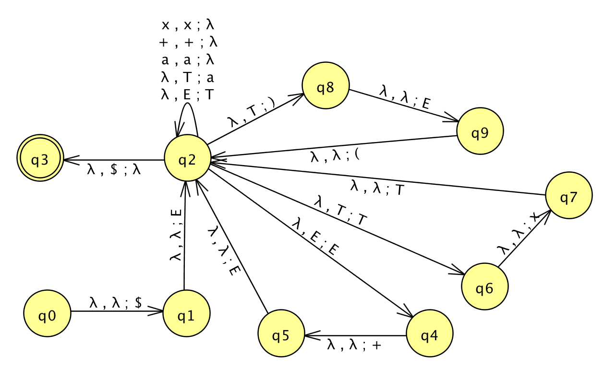

```
Student Name: David Zhu
Check one:
[X] I completed this assignment without assistance or external resources.
[ ] I completed this assignment with assistance from ___
   and/or using these external resources: ___
```

### 1.

a. Truth table for `a XOR (b OR a)`

_a_ | _b_ | _b_ OR _a_ | _a_ XOR (_b_ OR _a_)
----|-----|------------|---------------------
 F  |  F  | F          | F
 F  |  T  | T          | T
 T  |  F  | T          | F
 T  |  T  | T          | F

b. `XOR`. The two conditions are mutually exclusive in the English `or`. Here, if you _do_ eat your meat and then have pudding, the whole original sentence is true. However, `you can't have any pudding` was set to false to make this happen.

### 2.



### 3.

```
E -> E + E | T
T -> T x T | (E) | a

# Get a new starting position.
S -> E

# Set terminals to their own productions.
P -> +
X -> x
L -> (
R -> )
A -> a

# Update.
S -> E    # This can be removed.
E -> EPE
E -> T    # This can be removed.
T -> TXT
T -> LER
T -> A    # This can be removed.

# Update #2.
S -> EPE | TXT | LER | A
E -> EPE | TXT | LER | A

# Get the left side down.
F -> EP
U -> TX
M -> LE

# Final.
S -> FE | UT | MR | a
E -> FE | UT | MR | a
T -> UT | MR | a
F -> EP
U -> TX
M -> LE
P -> +
X -> x
L -> (
R -> )
```

### 4.

Part of this language contains the following productions.

```
T -> (E)
E -> T

# Which means...
T -> (T)
```

This part could also be described as
```
L = {a^nb^n}
```

From prior exercises, we know that this can not be described with a regular language because matching the count of two different letters require something like a stack. In other words, regular languages cannot keep a potentially infinite count. This has been proven with prior pumping lemmas.

### 5.

a.

```
K = {a^n b^n c^n} # From Theorem 1, this language is not context-free.

L_1 = {a^d b^d c^e}
L_2 = {a^f b^f c^g}
L = L_1 + L_2 # The intersection of the two languages.

# Let's choose a string that falls in L.
Q = a^h b^i c^j

# If Q is in L, it must satisfy L_1's constraint.
# Therefore, h == i
Q = a^i b^i c^j

# Q must also satisfy L_2's constraint at the same time.
# Therefore, i == j
Q = a^i b^i c^i
```

However, now `Q` must also be a string in `K`, which is not context free.

Therefore, the intersection of `L_1` and `L_2`, both of which are context-free (from prior work/homework), produced a string that is not context free. This is an example of how context free languages are not closed under intersection.

b.

If _p_, then _q_.

From the contrapositive, if not _q_, then _p_.

From the pumping lemma of context-free languages:

If _L_ is a context-free language, then there exists a _p_ (the pumping length) such that for any string _s_ in _L_, where the length of _s_ >= _p_, there exists _u_, _v_, _x_, _y_, _z_, such that

1. _s_ = _uvxyz_ (_s_ can be broken up into 5 parts)
2. | _vxy_ | <= _p_
3. | _vy_ | > 0

and for any _i_ >= 0, _uv^i xy^i z_ is in _L_.

Now, let's write the contrapositive.

If the following (lemma) property is true:

For any _p_ (the pumping length), there exists a _s_ in _L_ where the length of _s_ >= _p_, such that for any _u_, _v_, _x_, _y_, _z_ where:

1.  _s_ = _uvxyz_
2. | _vxy_ | <= _p_
3. | _vy_ | > 0

There exists _uv^i xy^i z_ not in _L_ where _i_ >= 0.

Then _L_ is not a context-free language.

Ok. let _L_ = _{a^n b^n c^n}_. Let's try to make the inverse of the lemma property valid.

Let _p1_ be a pumping length. Then let

_s1_ = _a a^i b b^i c_

[TODO: Complete.]

### 6.

a.

```
# First left most derivation.
S -> NP VP -> DET N VP -> The girl VP -> The girl VP PP -> The girl V NP PP
  -> The girl touches NP PP -> The girl touches DET N PP
  -> The girl touches the boy PP -> The girl touches the boy P NP
  -> The girl touches the boy with NP -> The girl touches the boy with DET N
  -> The girl touches the boy with the flower

# Second left most derivation.
S -> NP VP -> DET N VP -> The girl VP -> The girl V NP -> The girl touches NP
  -> The girl touches NP PP -> The girl touches DET N PP
  -> The girl touches the boy PP -> The girl touches the boy P NP
  -> The girl touches the boy with NP -> The girl touches the boy with DET N
  -> The girl touches the boy with the flower
```

b.

From the first derivation, we interpret that the girl uses the flower to touch the boy. From the second derivation, we interpret that the boy has the flower, and the girl touches the boy.

c.

```
S -> NP VP -> DET N VP -> A boy VP -> A boy VP PP -> A boy V NP PP
  -> A boy sees NP PP -> A boy sees DET N PP
  -> A boy sees a flower PP -> A boy sees a flower P NP
  -> A boy sees a flower with NP -> A boy sees a flower with DET N
  -> A boy sees a flower with the binoculars

The NP VP would cause a similar ambiguity as 6a.
```

d.

```
S -> NP VP
NP -> NP PP
NP -> DET N | DET A N | N
VP -> V NP
VP -> VP PP
DET -> a | the
A -> tall | purple
N -> boy | girl | flowers | binoculars
V -> touches | sees
PP -> P NP
P -> in | from | with
```
