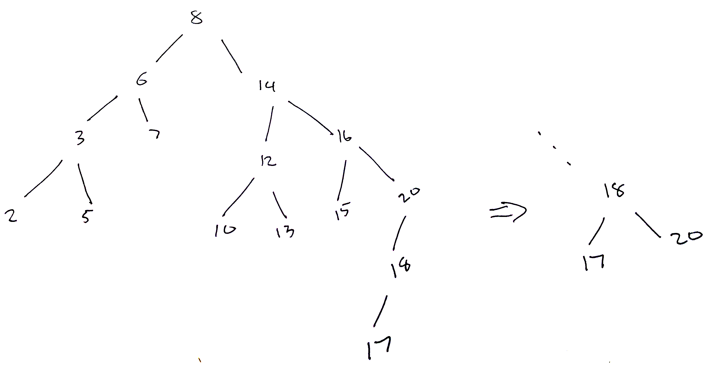

```
Student Name: David Zhu
Check one:
[X] I completed this assignment without assistance or external resources.
[ ] I completed this assignment with assistance from ___
   and/or using these external resources: ___
```

### I-1

T1 <= c <= T2 <= b <= T3

### I-2

T1 <= d <= T2 <= e <= T3

### I-3

T1 <= g <= T2 <= h <= T3 <= f <= T4

### II-4

```
A)
    y
  /   \
x       z

B)
        z
      /
    y
  /
x

C)
x
  \
    y
      \
        z

D)
    z
  /
x
  \
    y

E)
x
  \
    z
  /
y
```

### III-5

This property only holds for I-1 and I-2. I-3 is unbalanced because the left subtree is 2 deeper than the right subtree.

### IV-6

```
        f
       / \
      /   \
     g     T4
    / \
   /   \
 T1     h
       / \
      /   \
    T2     T3

       f
      / \
     h   T4
    / \
   g   T3  
  / \
T1   T2

     h
    / \
   g   \
  / \   \
T1   T2  f
        / \
      T3   T4
```

### V-7

The depth of the `6` subtree is 3. The depth of the `14` subtree is 4. This difference does not exceed 1. Therefore, the tree is almost-balanced.

### V-8


13 goes on the right subtree of 12. The resulting tree is almost-balanced.

### V-9



`17` goes on the left subtree of `18`. The resulting tree is unbalanced, so we right rotate `20` to balance it.

### V-10


`4` goes on the left subtree of '5'. The resulting tree is unbalanced, so we left rotate `5`, and then right rotate `6`.
