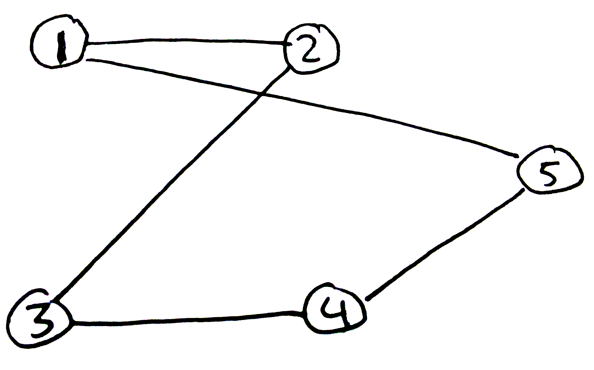
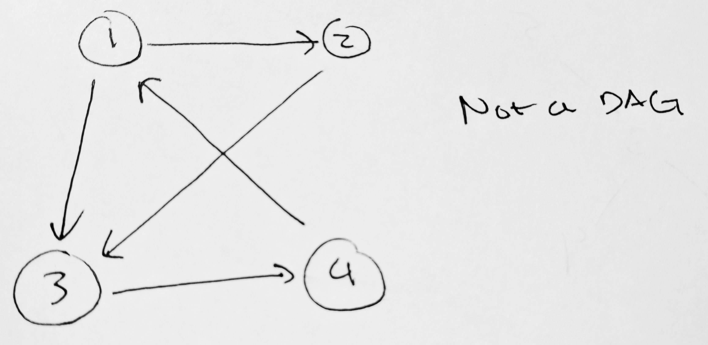

```
Student Name: David Zhu
Check one:
[X] I completed this assignment without assistance or external resources.
[ ] I completed this assignment with assistance from ___
   and/or using these external resources: ___
```

### 1

i   - b
ii  - a
iii - d
iv  - c

### 2

`1a` and `1d` contain a cycle.

`1a` - 1, 2, 3, 4, 1, ...
`1d` - 1, 2, 5, 1, ...

### 3



### 4

G = ({1, 2, 3, 4, 5, 6}, {{1, 2}, {1, 3}, {1, 4}, {2, 3}, {3, 4}, {3, 5}, {4, 5}})

### 5

i   - a
ii  - c
iii - b

### 6

`a` and `c` are DAGs.

### 7



### 8

G = ({1, 2, 3, 4}, {(1, 2), (2, 4), (3, 1), (3, 2), (3, 4)})

### 9

|   | 1 | 2 | 3 | 4 |
|---|---|---|---|---|
| 1 | 0 | 1 | 0 | 1 |
| 2 | 0 | 0 | 0 | 0 |
| 3 | 0 | 1 | 0 | 1 |
| 4 | 0 | 0 | 0 | 0 |
