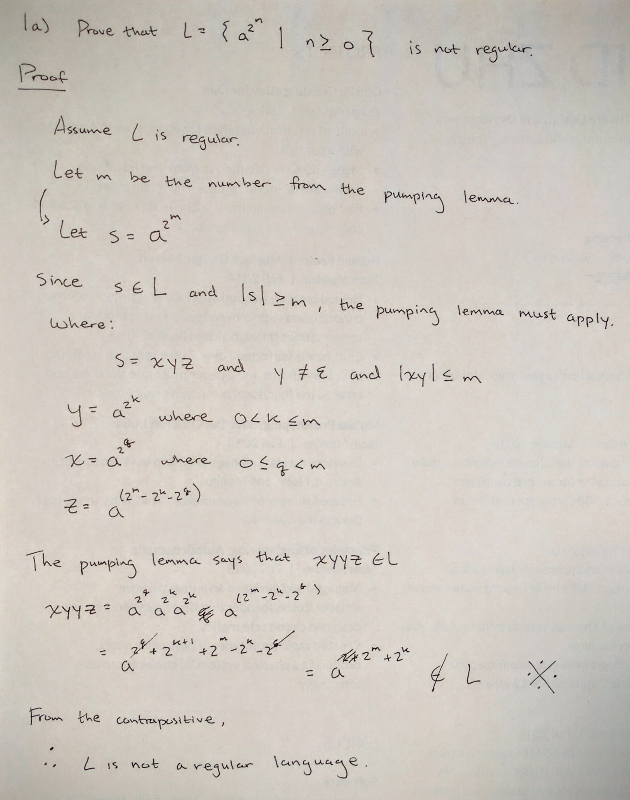
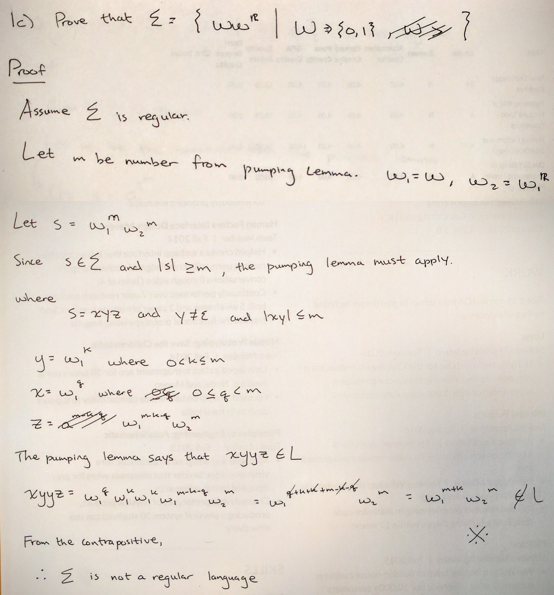
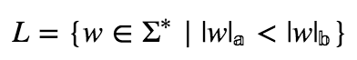
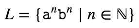
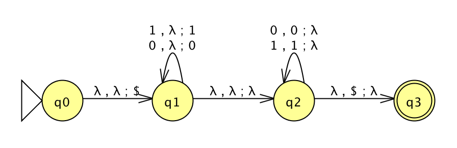

```
Student Name: David Zhu
Check one:
[ ] I completed this assignment without assistance or external resources.
[X] I completed this assignment with assistance from ___
    and/or using these external resources:
    - https://www.youtube.com/watch?v=LC0J45agGBU
```
### 1. Determining whether language is regular or not

a. Not regular.



b. Regular.

`10` and `01` has the ability to alternate, allowing for a finite state machine that can keep the counts of these two patterns the same.

```
((1|(01)+)|(0|(10)+))*
```

c. Not regular.



### 2. Playing the pumping game

a. Problem 1: http://weitz.de/pump/?ex=0



```python
L = {a, b}

# It also claims it can build a finite automaton accepting L using 16 states.

# My choice:
w = (a^16)*(b^17)

# Computer's loop choice:
aaa[aaaa]aaaaaaaaabbbbbbbbbbbbbbbbbb

# My pumped string not in L:
w2 = (a^20)*(b^17)
```

b. Problem 2: http://weitz.de/pump/?ex=1



```python
L = {a, b}

# It also claims it can build a finite automaton accepting L using 14 states.

# My choice:
w = (a^14)*(b^14)

# Computer's loop choice:
a[aaaaaaa]aaaaaabbbbbbbbbbbbbb

# My pumped string not in L:
w2 = (a^28)*(b^14)
```

### 3. Create a PDA

Refer to `3.jff`. I chose Problem 1C.


