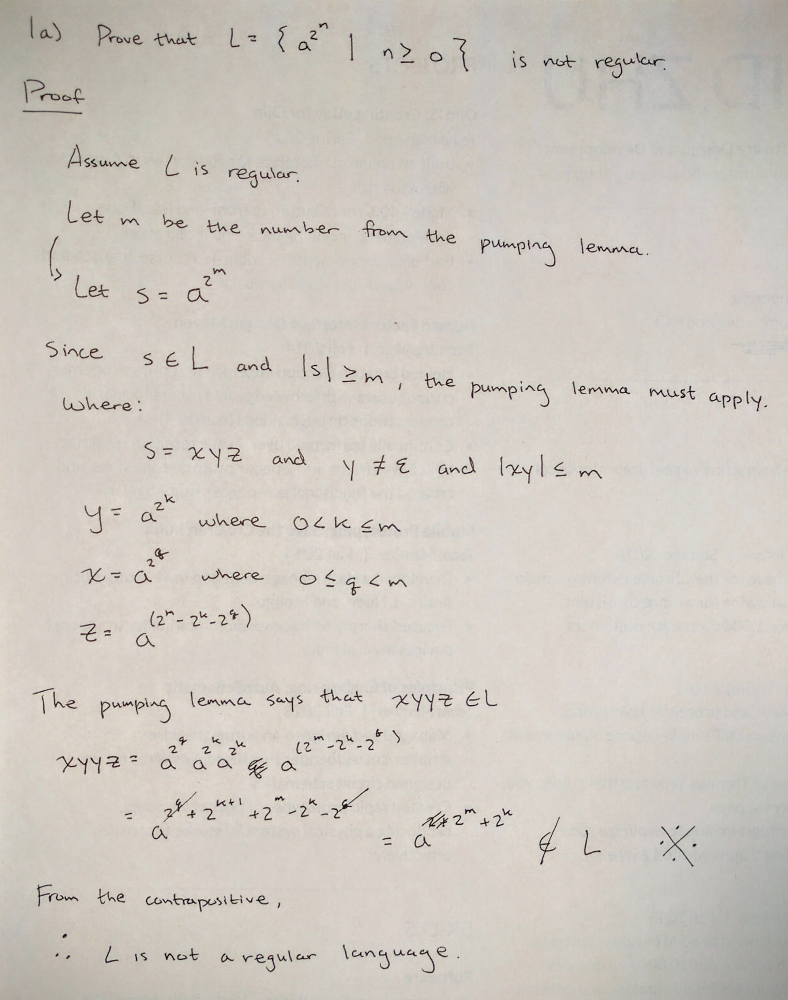
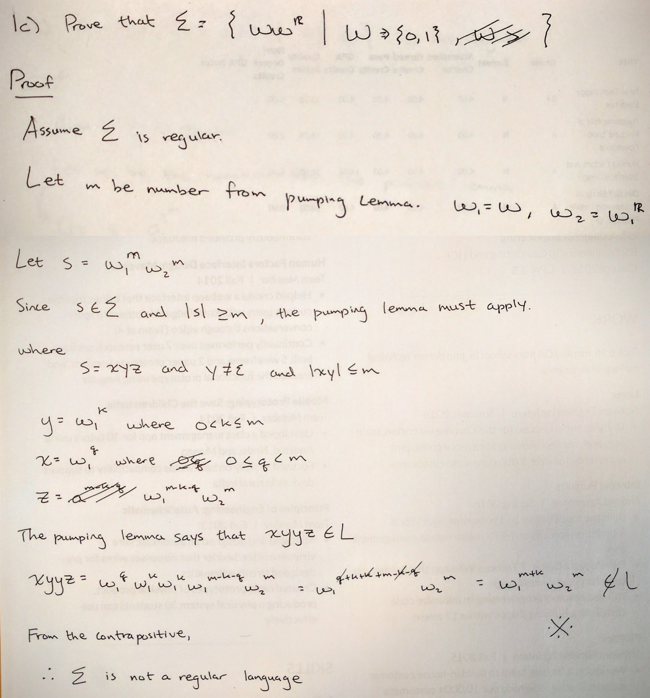

```
Student Name: David Zhu
Check one:
[ ] I completed this assignment without assistance or external resources.
[X] I completed this assignment with assistance from ___
    and/or using these external resources:
    - https://www.youtube.com/watch?v=LC0J45agGBU
```
### 1. Determining whether language is regular or not

a. Not regular.



b. Regular.

`10` and `01` has the ability to alternate, allowing for a finite state machine that can keep the counts of these two patterns the same.

```
((1|(01)+)|(0|(10)+))*
```

c. Not regular.



### 2. Playing the pumping game

a.

b.

### 3. Create a PDA
