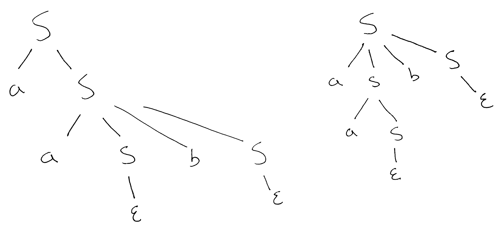

```
Student Name: David Zhu
Check one:
[X] I completed this assignment without assistance or external resources.
[ ] I completed this assignment with assistance from ___
   and/or using these external resources: ___
```

## 2. Constructing grammars

### a.
```R
L = {0 , 1}
V = {S}
S = S

S -> 0S0 | 1S1 | ε

# Derivation
S -> 0S0 -> 01S10 -> 010S010 -> 010010
```

### b.
```R
L = {a, b, c}
V = {S, C}
S = S

S -> aSbC | ε
C -> cC | ε
```

### c.
```R
L = {a, b, c}
V = {S, A}
S = S

S -> aAbSc | ε
A -> aA | ε
```

### d.
```R
L = {a, b}
V = {S}
S = S

# Grammar 1.
S -> abS | ε

# Grammar 2.
S -> Sab | ε
```

## 4. Ambiguous grammars

### a. Parse trees



### b. Leftmost derivations
```R
# First option.
S -> a S
  -> a a S b S
  -> a a b S
  -> a a b

# Second option.
S -> a S b S
  -> a a S b S
  -> a a b S
  -> a a b
```

### c. Rightmost derivations
```R
# First option.
S -> a S
  -> a a S b S
  -> a a S b
  -> a a b

# Second option.
S -> a S b S
  -> a S b
  -> a a S b
  -> a a b
```

### d. Extra credit
Based on the grammar provided, `b`s can only be produced in the presence of an `a`. However, `a` can be produced independently. We want to prove that `a`s will always be equal or more than `b`s.

This means that `count(a) - count(b) = difference >= 0`.

```R
# Let difference start at 0.
difference = 0

# Expanded form.
S -> a S      # This allows difference++
S -> a S b S  # This keeps the difference the same
S -> ε        # This keeps the difference the same
```

Therefore, there are no opportunities for `difference` to fall below 0. `difference >= 0`, and there are at least as many `a`s as `b`s.
